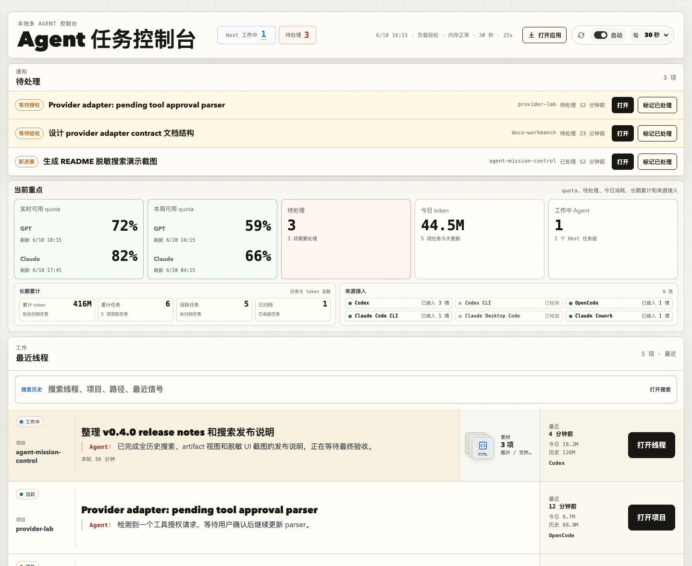

# Agent Mission Control

本地多 Agent 任务控制台，用来集中查看 Codex、OpenCode、Claude Code / Claude Desktop 等工具里的线程、项目、token 用量、运行状态和待处理事项。

它默认只监听 `127.0.0.1`，只读取本机状态文件，不写入 Codex / OpenCode / Claude 的工作数据，也不发送遥测。

## 功能截图



截图由 `npm run screenshot:mock` 通过虚构数据生成，只展示界面形态，不包含本机线程、路径、消息、token 或 quota 细节。

## 最近更新

- 新增全历史搜索：本地 SQLite FTS 索引支持按标题、项目、路径、最近输入、Agent 输出和 artifact 信息检索历史线程。
- 新增 Codex artifact 视图：可从 rollout 中识别本地文件、图片、HTML、Markdown 和 URL，并在搜索结果或线程详情中预览 / 打开。
- 更新 README 脱敏演示截图，使用虚构数据展示 0.4 搜索入口和 artifact 摘要布局。
- Codex 默认读取窗口提升到 5000，并补充读取近期未进入 sqlite 的 rollout-only 会话，隐藏历史线程可用 `codex resume` 恢复。
- 已安装 PWA 的窗口操作从“最小化”改为“隐藏”，避免在 Dock 右侧留下缩略图。
- 自动刷新默认 30 秒，可切到 10 秒或 60 秒；后台页面暂停拉取，窗口失焦自动降频到 60 秒，服务端用 dashboard / 通知快照和性能指标降低持续读盘与 JSON 解析压力。
- 新增 Agent 评审工作流：可把线程输出交给本机可用的 Codex / Claude / OpenCode 进行二次评审，支持多种评审模板、自定义审查要求、评审历史和完成提醒。
- quota 总览支持按 GPT、Claude 等模型家族分组，Claude Desktop / Cowork 可从本地 Claude usage cache 读取聚合限额信号。

完整版本记录见 [CHANGELOG.md](CHANGELOG.md)。

## 功能

- 汇总 Codex 本地全量线程窗口、标题、项目、归档状态、模型、token 和 quota 信息。
- 汇总 OpenCode CLI / Desktop 会话，并识别待授权工具调用和 todo。
- 汇总 Claude Code CLI、Claude Desktop Code、Claude Cowork 会话。
- 按 GPT、Claude 等模型家族展示实时和本周 quota 可用量。
- 支持按来源、状态、项目和关键词筛选。
- 支持全历史搜索和项目历史视图，搜索索引写在本机 `~/.agent-mission-control/search-index.sqlite`。
- 支持打开 Codex / OpenCode / Claude Desktop Code deep link，或在 macOS Terminal 恢复 CLI 会话。
- 支持查看 Codex 线程里提到的本地文件、图片、HTML、Markdown 和 URL artifact，并按需预览图片或打开本地文件。
- 支持从线程详情发起 Agent 评审：选择输入范围、目标 Agent、评审模板或自定义审查要求，并查看评审历史、复制结果或修复 Prompt。
- 支持安装为本地 PWA 应用窗口；service worker 只缓存静态前端壳，不缓存 `/api/*` 本机 Agent 元数据。
- 提供本地通知中心；系统桌面提醒当前隐藏，待后续接入可靠的原生通知实现。

## 要求

- Node.js `>=20`
- macOS 推荐；Linux / Windows 可运行看板，但部分打开应用和桌面通知能力取决于系统命令
- 可选：`sqlite3` 命令，用于读取 Codex 本地 SQLite 状态
- 可选：`codex`、`opencode`、`claude` CLI，用于检测版本、恢复 CLI 会话，或作为 Agent 评审目标

## 运行

```bash
git clone https://github.com/forxidian/agent-mission-control.git
cd agent-mission-control
npm start
```

打开：

```text
http://127.0.0.1:4629
```

安装成网页应用：

- 在 Chrome / Edge 打开本地地址后，点击顶部的“安装应用”按钮，或使用地址栏里的安装入口。
- 安装后会像普通桌面应用一样以独立窗口打开；再次从浏览器页点击顶部按钮会优先通过本地服务打开 macOS 上的 Chrome/Edge PWA app shim。
- 如果本地 app shim 不可用，会再尝试 `web+agentmissioncontrol:` 协议唤起；卸载可从浏览器应用菜单完成。
- 独立 PWA 窗口内提供“隐藏”按钮，可隐藏窗口且不在 Dock 右侧留下最小化缩略图；点击 Dock 里的常驻应用图标可再次唤起。
- PWA 只缓存前端壳子和图标，不缓存 `/api/*` 返回的本机 Agent 元数据。

可选环境变量：

```bash
PORT=4629 HOST=127.0.0.1 npm start
```

不要把 `HOST` 绑定到公网或不可信局域网地址，除非你已经评估过本机 Agent 元数据暴露风险。

## 数据来源

Codex：

- `~/.codex/state_5.sqlite`
- `~/.codex/session_index.jsonl`
- `~/.codex/sessions/**/rollout-*.jsonl`

OpenCode：

- `opencode session list --max-count 120 --format json`
- `~/Library/Application Support/ai.opencode.desktop/opencode.global.dat`
- OpenCode Desktop workspace state/cache 文件

Claude：

- `~/.claude/projects/**/*.jsonl`
- `~/Library/Application Support/Claude/claude-code-sessions/**/*.json`
- `~/Library/Application Support/Claude/local-agent-mode-sessions/**/*.json`
- 同目录下的 `audit.jsonl` 和 `spaces.json`

本项目自己的通知状态：

- `~/.agent-mission-control/notifications.json`
- `~/.agent-mission-control/reviews.jsonl`
- `~/.agent-mission-control/search-index.sqlite`

Agent 评审：

- 评审输入默认来自面板已经知道的线程字段，或 Codex 线程的本地 rollout JSONL。
- 评审任务会调用本机已安装且可用的目标 CLI，并把生成的评审记录写入 `~/.agent-mission-control/reviews.jsonl`。
- 评审 runner 默认以只读或禁用写入工具的方式运行，避免目标 Agent 在评审过程中改写项目文件。
- 评审 Prompt 会要求目标 Agent 非必要不读取文件，并避免读取 `.env`、密钥、cookie、token、私有配置或本地 Agent 状态文件。
- 评审面板会展示目标 Agent 的 repo 读取/写入保护能力，并支持按 Fix Loop 状态筛选评审记录。

## 隐私

这个项目用于本地查看你的 Agent 工作状态。它可能在浏览器里展示线程标题、项目路径、最近消息信号、token、quota 信息和评审结果。详见 [docs/PRIVACY.md](docs/PRIVACY.md)。

请不要提交本机状态文件、日志、数据库、`.env`、截图里的私密文本、cookie、token 或 API key。

## 开发

```bash
npm test
```

项目刻意保持轻依赖：当前没有外部 npm 依赖，主要使用 Node.js 内置 test runner、浏览器原生 API 和系统命令。

版本变化见 [CHANGELOG.md](CHANGELOG.md)。

生成 README 演示图：

```bash
npm run screenshot:mock
```

这个命令会启动真实前端和 mock API，并用 Chrome headless 截图。
如果 Chrome 不在默认 macOS 路径，可以通过 `CHROME_PATH` 指定浏览器可执行文件；如果端口被占用，可以通过 `PORT` 指定临时端口。

## 开源准备

这份仓库已按开源发布做过基础脱敏整理。发布前复核清单见 [docs/OPEN_SOURCE_PLAN.md](docs/OPEN_SOURCE_PLAN.md)。
